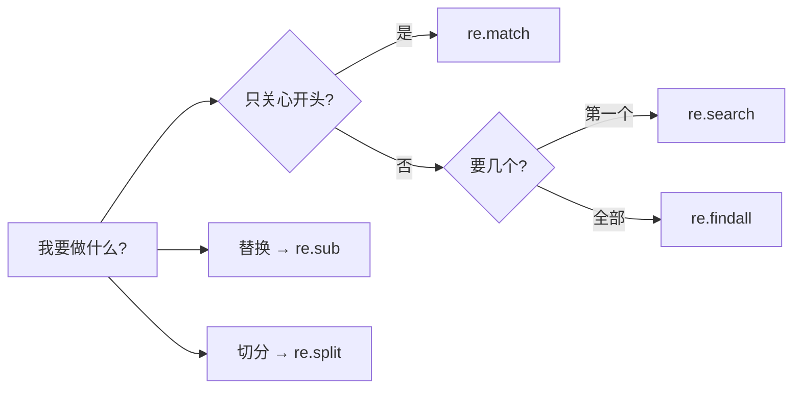
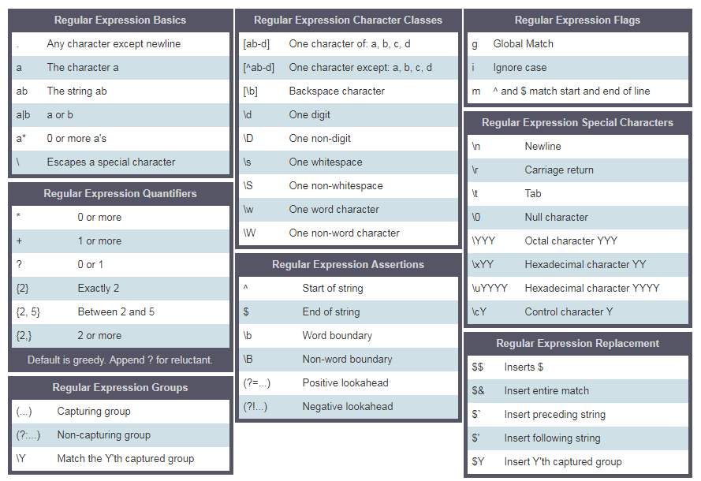
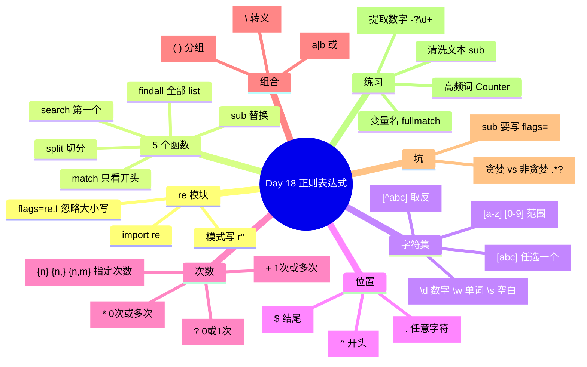

# Day 18 · 正则表达式（RegEx）


**一句话**：正则 = 用一串"模式"去文本里 **找 / 取 / 换 / 切** 东西；Python 用 `re` 模块，模式写成 `r'...'`。

---

## 1. 5 个核心函数（先记这张表）

| 函数 | 做什么 | 返回 |
|---|---|---|
| `re.match(p, s)` | **只看开头**是否匹配 | Match 对象 / `None` |
| `re.search(p, s)` | 全文找**第一个** | Match 对象 / `None` |
| `re.findall(p, s)` | 全文找**所有** | `list` |
| `re.sub(p, 新, s)` | **替换**所有匹配 | 新字符串 |
| `re.split(p, s)` | 按匹配处**切开** | `list` |



```python
import re
txt = 'I love to teach python and javaScript'

m = re.match('I love to teach', txt, re.I)   # re.I = 忽略大小写
print(m.span())               # (0, 15) → 起止位置
print(txt[m.start():m.end()]) # I love to teach
print(re.match('love', txt))  # None（不在开头）

re.findall('python', 'Python and python', re.I)  # ['Python', 'python']
re.sub('%', '', 'te%ac%her')                     # 'teacher'  清洗文本
re.split('\n', 'line1\nline2')                   # ['line1', 'line2']
```

---

## 2. 模式语法速查

| 符号 | 含义 | 例子 → 结果 |
|---|---|---|
| `[abc]` `[a-z]` `[0-9]` | 字符集：其中**任意一个** | `[Pp]ython` → Python / python |
| `[^abc]` | 字符集里的 `^` = **取反** | `[^A-Za-z ]+` → 非字母非空格 |
| `\d` / `\D` | 数字 / 非数字 | `\d` → '6','2','0'... |
| `\w` / `\s` | 字母数字下划线 / 空白 | |
| `.` | 任意字符（除 `\n`） | `a.` → 'an','ar' |
| `^` / `$` | 开头 / 结尾 | `^This`、`love$` |
| `*` | 0 次或多次 | `a.*` |
| `+` | 1 次或多次 | `\d+` → '2019' |
| `?` | 0 次或 1 次（可选） | `[Ee]-?mail` → email / e-mail |
| `{4}` `{3,}` `{1,4}` | 精确 / 至少 / 范围次数 | `\d{4}` → '2019' |
| `a\|b` | 或 | `apple\|banana` |
| `( )` | 分组 + 捕获 | |
| `\` | 转义特殊字符 | `\.` 匹配真正的点 |

**必背 3 个例子**

```python
txt = 'made on December 6,  2019 and revised on July 8, 2021'
re.findall(r'\d', txt)     # ['6','2','0','1','9',...]  一个一个数字 ✗
re.findall(r'\d+', txt)    # ['6', '2019', '8', '2021']  完整数字 ✓
re.findall(r'\d{4}', txt)  # ['2019', '2021']            只要 4 位 ✓
```

### 速查图（原教程附图）



> ⚠️ 这张图是通用/JavaScript 风格：`g` 标志和 `$1` 替换写法 **Python 里没有**。Python 用 `re.findall` 代替 `g`，替换引用分组写 `\1`。

---

## 3. 容易踩的坑

1. **写模式永远用 `r'...'`**（原始字符串），否则 `\d`、`\b` 会被 Python 先转义掉
2. **`re.sub` 的第 4 个位置参数是 `count` 不是 flags**：`re.sub(p, new, s, re.I)` 实际是"最多替换 2 次"（`re.I == 2`）。正确写法：`re.sub(p, new, s, flags=re.I)`（原教程这里写错了）
3. `match` 只看开头 → 大多数情况用 `search` / `findall`
4. `^` 在 `[]` 外 = 开头；在 `[]` 里第一位 = 取反
5. `*` `+` 默认**贪婪**（尽量多吃），加 `?` 变非贪婪：`.*?`

---

## 4. 练习要点（我自己做时的思路）

| 等级 | 题目 | 关键工具 |
|---|---|---|
| L1 | 段落里最高频的词 | `re.findall(r'\w+', s)` + `collections.Counter` |
| L1 | 提取坐标并算最远两点距离 | `re.findall(r'-?\d+', s)` → `int` → `max - min` |
| L2 | 判断是否是合法变量名 | `re.fullmatch(r'[A-Za-z_]\w*', name)` |
| L3 | 清洗乱码文本 + 前 3 高频词 | `re.sub(r'[^A-Za-z ]', '', s)` + `Counter.most_common(3)` |

---

## 5. 思维导图



---

## 我的行动
- [ ] 做完 L1–L3 练习，代码放进这篇笔记
- [ ] 用 [regex101.com](https://regex101.com)（选 Python 模式）调试每个模式

---
相关：30 Days of Python
