# Day 18 - 正则表达式(Regular Expressions)

```mermaid
%%{init: {'flowchart': {'curve': 'basis', 'nodeSpacing': 8, 'rankSpacing': 40}}}%%
flowchart LR
  R(["Day 18 正则表达式"])
  R --- b0["re 模块"]
  b0 --- n1["import re"]
  b0 --- n2["模式写成 r'...'"]
  b0 --- n3["flags=re.I 忽略大小写"]
  classDef c0 fill:none,stroke:#F5A623,stroke-width:2px,color:#F5A623,font-weight:bold
  class b0 c0
  R --- b1["5 个核心函数"]
  b1 --- n4["re.match()"]
  subgraph sn4[" "]
  n4 --- n5["只看开头"]
  n4 --- n6["返回 Match 或 None"]
  end
  style sn4 fill:none,stroke:none
  b1 --- n7["re.search()"]
  subgraph sn7[" "]
  n7 --- n8["全文找第一个"]
  end
  style sn7 fill:none,stroke:none
  b1 --- n9["re.findall()"]
  subgraph sn9[" "]
  n9 --- n10["全文找所有"]
  n9 --- n11["返回 list"]
  end
  style sn9 fill:none,stroke:none
  b1 --- n12["re.sub()"]
  subgraph sn12[" "]
  n12 --- n13["替换所有匹配"]
  end
  style sn12 fill:none,stroke:none
  b1 --- n14["re.split()"]
  subgraph sn14[" "]
  n14 --- n15["按匹配处切开，返回 list"]
  end
  style sn14 fill:none,stroke:none
  classDef c1 fill:none,stroke:#4A90E2,stroke-width:2px,color:#4A90E2,font-weight:bold
  class b1 c1
  R --- b2["字符集"]
  b2 --- n16["[abc] 任选一个"]
  b2 --- n17["[a-z] [0-9] 范围"]
  b2 --- n18["[^abc] 取反"]
  b2 --- n19["\d 数字 · \D 非数字"]
  b2 --- n20["\w 单词字符 · \s 空白"]
  classDef c2 fill:none,stroke:#2ECC71,stroke-width:2px,color:#2ECC71,font-weight:bold
  class b2 c2
  R --- b3["位置"]
  b3 --- n21["^ 开头"]
  b3 --- n22["$ 结尾"]
  b3 --- n23[". 任意字符（除换行）"]
  classDef c3 fill:none,stroke:#A66CFF,stroke-width:2px,color:#A66CFF,font-weight:bold
  class b3 c3
  R --- b4["次数"]
  b4 --- n24["* 0 次或多次"]
  b4 --- n25["+ 1 次或多次"]
  subgraph sn25[" "]
  n25 --- n26["\d+ 取完整数字"]
  end
  style sn25 fill:none,stroke:none
  b4 --- n27["? 0 或 1 次"]
  subgraph sn27[" "]
  n27 --- n28["[Ee]-?mail"]
  end
  style sn27 fill:none,stroke:none
  b4 --- n29["{n} {n,} {n,m} 指定次数"]
  subgraph sn29[" "]
  n29 --- n30["\d{4} 只要 4 位"]
  end
  style sn29 fill:none,stroke:none
  classDef c4 fill:none,stroke:#FF6B6B,stroke-width:2px,color:#FF6B6B,font-weight:bold
  class b4 c4
  R --- b5["组合"]
  b5 --- n31["a|b 或"]
  b5 --- n32["( ) 分组捕获"]
  b5 --- n33["\ 转义特殊字符"]
  classDef c5 fill:none,stroke:#1ABC9C,stroke-width:2px,color:#1ABC9C,font-weight:bold
  class b5 c5
  R --- b6["容易踩的坑"]
  b6 --- n34["永远用 r'...'"]
  b6 --- n35["re.sub 要写 flags=re.I"]
  subgraph sn35[" "]
  n35 --- n36["第 4 个位置参数是 count"]
  end
  style sn35 fill:none,stroke:none
  b6 --- n37["match 只看开头"]
  b6 --- n38["贪婪 vs 非贪婪 .*?"]
  classDef c6 fill:none,stroke:#F06292,stroke-width:2px,color:#F06292,font-weight:bold
  class b6 c6
  R --- b7["练习要点"]
  b7 --- n39["高频词"]
  subgraph sn39[" "]
  n39 --- n40["findall + Counter"]
  end
  style sn39 fill:none,stroke:none
  b7 --- n41["提取数字"]
  subgraph sn41[" "]
  n41 --- n42["-?\d+"]
  end
  style sn41 fill:none,stroke:none
  b7 --- n43["合法变量名"]
  subgraph sn43[" "]
  n43 --- n44["re.fullmatch"]
  end
  style sn43 fill:none,stroke:none
  b7 --- n45["清洗文本"]
  subgraph sn45[" "]
  n45 --- n46["re.sub 去掉符号"]
  end
  style sn45 fill:none,stroke:none
  classDef c7 fill:none,stroke:#FFC107,stroke-width:2px,color:#FFC107,font-weight:bold
  class b7 c7
  classDef leaf fill:none,stroke:none,color:#9AA0A6
  classDef root fill:#5B5FC7,stroke:none,color:#fff,font-weight:bold
  class R root
  class n1,n2,n3,n4,n5,n6,n7,n8,n9,n10,n11,n12,n13,n14,n15,n16,n17,n18,n19,n20,n21,n22,n23,n24,n25,n26,n27,n28,n29,n30,n31,n32,n33,n34,n35,n36,n37,n38,n39,n40,n41,n42,n43,n44,n45,n46 leaf
  linkStyle 0 stroke:#F5A623,stroke-width:1.5px
  linkStyle 1 stroke:#F5A623,stroke-width:1.5px
  linkStyle 2 stroke:#F5A623,stroke-width:1.5px
  linkStyle 3 stroke:#F5A623,stroke-width:1.5px
  linkStyle 4 stroke:#4A90E2,stroke-width:1.5px
  linkStyle 5 stroke:#4A90E2,stroke-width:1.5px
  linkStyle 6 stroke:#4A90E2,stroke-width:1.5px
  linkStyle 7 stroke:#4A90E2,stroke-width:1.5px
  linkStyle 8 stroke:#4A90E2,stroke-width:1.5px
  linkStyle 9 stroke:#4A90E2,stroke-width:1.5px
  linkStyle 10 stroke:#4A90E2,stroke-width:1.5px
  linkStyle 11 stroke:#4A90E2,stroke-width:1.5px
  linkStyle 12 stroke:#4A90E2,stroke-width:1.5px
  linkStyle 13 stroke:#4A90E2,stroke-width:1.5px
  linkStyle 14 stroke:#4A90E2,stroke-width:1.5px
  linkStyle 15 stroke:#4A90E2,stroke-width:1.5px
  linkStyle 16 stroke:#4A90E2,stroke-width:1.5px
  linkStyle 17 stroke:#2ECC71,stroke-width:1.5px
  linkStyle 18 stroke:#2ECC71,stroke-width:1.5px
  linkStyle 19 stroke:#2ECC71,stroke-width:1.5px
  linkStyle 20 stroke:#2ECC71,stroke-width:1.5px
  linkStyle 21 stroke:#2ECC71,stroke-width:1.5px
  linkStyle 22 stroke:#2ECC71,stroke-width:1.5px
  linkStyle 23 stroke:#A66CFF,stroke-width:1.5px
  linkStyle 24 stroke:#A66CFF,stroke-width:1.5px
  linkStyle 25 stroke:#A66CFF,stroke-width:1.5px
  linkStyle 26 stroke:#A66CFF,stroke-width:1.5px
  linkStyle 27 stroke:#FF6B6B,stroke-width:1.5px
  linkStyle 28 stroke:#FF6B6B,stroke-width:1.5px
  linkStyle 29 stroke:#FF6B6B,stroke-width:1.5px
  linkStyle 30 stroke:#FF6B6B,stroke-width:1.5px
  linkStyle 31 stroke:#FF6B6B,stroke-width:1.5px
  linkStyle 32 stroke:#FF6B6B,stroke-width:1.5px
  linkStyle 33 stroke:#FF6B6B,stroke-width:1.5px
  linkStyle 34 stroke:#FF6B6B,stroke-width:1.5px
  linkStyle 35 stroke:#1ABC9C,stroke-width:1.5px
  linkStyle 36 stroke:#1ABC9C,stroke-width:1.5px
  linkStyle 37 stroke:#1ABC9C,stroke-width:1.5px
  linkStyle 38 stroke:#1ABC9C,stroke-width:1.5px
  linkStyle 39 stroke:#F06292,stroke-width:1.5px
  linkStyle 40 stroke:#F06292,stroke-width:1.5px
  linkStyle 41 stroke:#F06292,stroke-width:1.5px
  linkStyle 42 stroke:#F06292,stroke-width:1.5px
  linkStyle 43 stroke:#F06292,stroke-width:1.5px
  linkStyle 44 stroke:#F06292,stroke-width:1.5px
  linkStyle 45 stroke:#FFC107,stroke-width:1.5px
  linkStyle 46 stroke:#FFC107,stroke-width:1.5px
  linkStyle 47 stroke:#FFC107,stroke-width:1.5px
  linkStyle 48 stroke:#FFC107,stroke-width:1.5px
  linkStyle 49 stroke:#FFC107,stroke-width:1.5px
  linkStyle 50 stroke:#FFC107,stroke-width:1.5px
  linkStyle 51 stroke:#FFC107,stroke-width:1.5px
  linkStyle 52 stroke:#FFC107,stroke-width:1.5px
  linkStyle 53 stroke:#FFC107,stroke-width:1.5px
```

---

## 补充说明

### 1. re 模块
- 用正则前先 `import re`
- 模式写成原始字符串 `r'...'`,避免 `\d` 这类写法被 Python 先转义
- `flags=re.I`:忽略大小写

### 2. 5 个核心函数
| 函数 | 作用 | 返回 |
|---|---|---|
| `re.match()` | 只看开头是否匹配 | Match 对象 / None |
| `re.search()` | 全文找第一个 | Match 对象 / None |
| `re.findall()` | 全文找所有 | 列表 |
| `re.sub()` | 替换所有匹配 | 新字符串 |
| `re.split()` | 按匹配处切开 | 列表 |

### 3. 字符集 [ ]
- `[abc]`:其中任意一个字符
- `[a-z]` / `[0-9]`:一个范围
- `[^abc]`:`^` 写在方括号里 = 取反
- `\d` 数字、`\w` 字母数字下划线、`\s` 空白(大写 `\D` `\W` `\S` = 取反)

### 4. 位置
- `^`:开头;`$`:结尾
- `.`:任意字符(换行除外)

### 5. 次数
| 符号 | 次数 | 例子 |
|---|---|---|
| `*` | 0 次或多次 | `a.*` |
| `+` | 1 次或多次 | `\d+` → 完整数字 '2019' |
| `?` | 0 或 1 次 | `[Ee]-?mail` → email / e-mail |
| `{n}` `{n,}` `{n,m}` | 指定次数 | `\d{4}` → 只要 4 位 |

### 6. 组合
- `a|b`:或
- `( )`:分组并捕获
- `\`:转义特殊字符,如 `\.` 匹配真正的点

### 7. 容易踩的坑
- 模式永远用 `r'...'`
- `re.sub()` 第 4 个位置参数是 `count`,不是 flags;忽略大小写要写 `flags=re.I`(原教程这里写错了)
- `match` 只看开头,大多数情况用 `search` / `findall`
- `*` `+` 默认**贪婪**(尽量多匹配),加 `?` 变非贪婪:`.*?`

### 8. 练习要点
| 题目 | 关键工具 |
|---|---|
| 段落里最高频的词 | `re.findall(r'\w+', s)` + `Counter` |
| 提取数字,算最远距离 | `re.findall(r'-?\d+', s)` |
| 判断合法变量名 | `re.fullmatch(r'[A-Za-z_]\w*', name)` |
| 清洗乱码文本 | `re.sub(r'[^A-Za-z ]', '', s)` |

---

[📚 目录](README.md) · [下一天：Day 19 文件处理 ➡️](Day19_文件处理.md)
