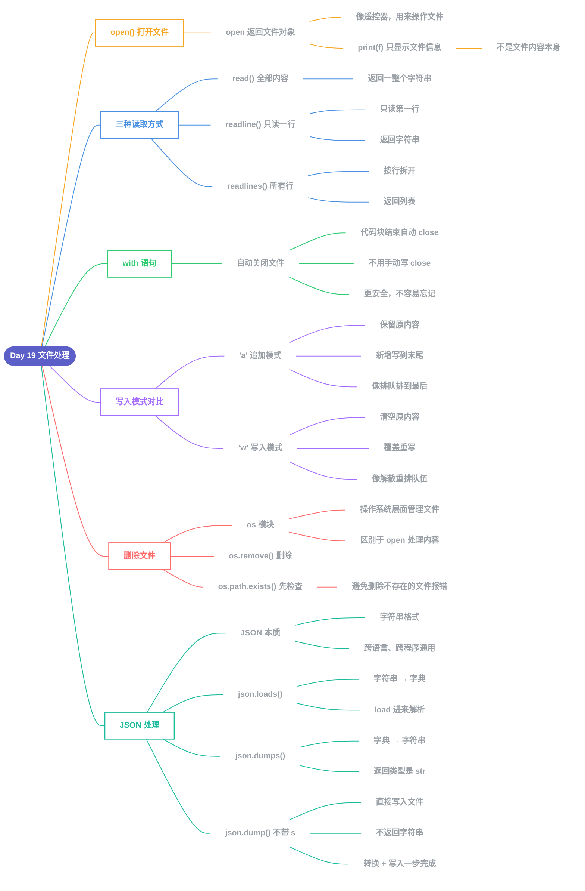

# Day 19 - 文件处理(File Handling)

---

## 文字版补充说明

### 1. open() 打开文件
- `open()` 返回的是一个**文件对象**(不是文件内容),相当于"操作文件的遥控器"
- `print(f)` 只会显示这个对象的元信息(路径、模式、编码),不是文件文字

### 2. 三种读取方式
| 方法 | 读取范围 | 返回类型 |
|---|---|---|
| `read()` | 全部内容 | 字符串 |
| `readline()` | 只有第一行 | 字符串 |
| `readlines()` | 所有行 | 列表(按行拆分) |

### 3. with 语句
- 离开缩进代码块后,自动关闭文件,不需要手动写 `f.close()`

### 4. 'a' vs 'w'
- **`'a'`(追加)**:保留原内容,新增写到文件末尾
- **`'w'`(写入)**:清空原内容,覆盖重写

### 5. 删除文件
- 用 `os` 模块(操作系统层面的文件管理),不是 `open()`
- 先用 `os.path.exists()` 检查文件是否存在,再决定要不要 `os.remove()`,避免报错

### 6. JSON 的本质
- JSON 是**字符串格式**,不属于任何具体语言,用于不同程序/语言间传递数据

### 7. loads / dumps / dump
| 函数 | 方向 | 结果 |
|---|---|---|
| `json.loads()` | 字符串 → 字典 | 返回字典 |
| `json.dumps()` | 字典 → 字符串 | 返回字符串 |
| `json.dump()` | 字典 → 文件 | 直接写入文件,不返回字符串 |
