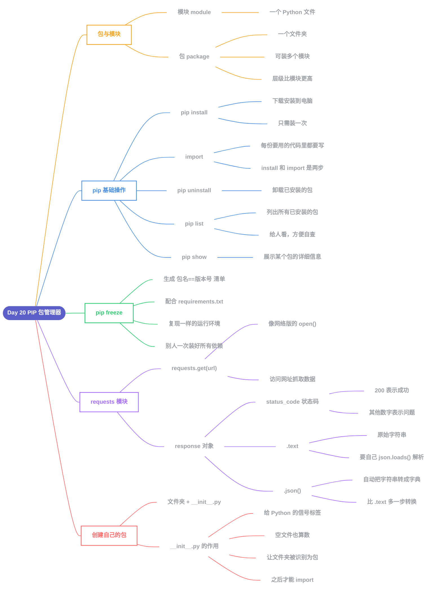

# Day 20 - PIP Python包管理器

---

## 补充说明

### 1. 包(package) vs 模块(module)
- **模块**:一个Python文件
- **包**:一个文件夹,可以装一个或多个模块,层级比模块更高

### 2. pip install 与 import 的关系
- `pip install` 把包下载安装到电脑上(装一次即可)
- `import` 在每一份需要用到它的代码文件里引入(每次都要写)

### 3. pip 管理命令
| 命令 | 作用 |
|---|---|
| `pip uninstall` | 卸载已安装的包 |
| `pip list` | 列出所有已安装的包 |
| `pip show` | 展示某个特定包的详细信息 |

### 4. pip freeze
- 生成"包名==版本号"格式的清单
- 配合 `requirements.txt` 使用,方便别人一次性复现相同的运行环境

### 5. requests 模块
- `requests.get(url)`:像"网络版的 `open()`",访问网址并抓取数据
- `response.status_code`:状态码(200 = 成功,其他数字通常代表问题)
- `response.text`:返回原始字符串,需要自己手动用 `json.loads()` 解析
- `response.json()`:自动完成"字符串转字典"这一步,比 `.text` 多做了一步转换

### 6. 创建自己的包
- 新建一个文件夹 + 里面放一个空的 `__init__.py`
- `__init__.py` 的存在本身,就是给 Python 的"信号标签",让这个文件夹被识别为一个正式的包,之后才能用 `import` 来使用

---
相关：30 Days of Python · 上一天：Day19_文件处理 · 下一天：Day21_类和对象
