# Day 21 - 类和对象(Classes and Objects)

```mermaid
%%{init: {'flowchart': {'curve': 'basis', 'nodeSpacing': 8, 'rankSpacing': 40}}}%%
flowchart LR
  R(["Day 21 类和对象"])
  R --- b0["基本概念"]
  b0 --- n1["类 class"]
  n1 --- n2["设计图纸 / 规则"]
  b0 --- n3["对象 object"]
  n3 --- n4["按图纸造出的具体实例"]
  b0 --- n5["命名规则"]
  subgraph sn5[" "]
  n5 --- n6["驼峰命名 CamelCase"]
  n5 --- n7["首字母大写"]
  end
  style sn5 fill:none,stroke:none
  b0 --- n8["实例化 instantiate"]
  n8 --- n9["调用类，造出一个具体对象"]
  classDef c0 fill:none,stroke:#F5A623,stroke-width:2px,color:#F5A623,font-weight:bold
  class b0 c0
  R --- b1["构造函数 __init__"]
  b1 --- n10["每次实例化自动执行"]
  b1 --- n11["初始化对象属性"]
  b1 --- n12["可以设默认参数值"]
  subgraph sn12[" "]
  n12 --- n13["不传就用默认值"]
  n12 --- n14["传了就覆盖"]
  end
  style sn12 fill:none,stroke:none
  classDef c1 fill:none,stroke:#4A90E2,stroke-width:2px,color:#4A90E2,font-weight:bold
  class b1 c1
  R --- b2["self"]
  b2 --- n15["代表当前这个对象自己"]
  b2 --- n16["Python 自动传入"]
  b2 --- n17["不用手动传值"]
  b2 --- n18["每个对象的 self 互相独立"]
  classDef c2 fill:none,stroke:#2ECC71,stroke-width:2px,color:#2ECC71,font-weight:bold
  class b2 c2
  R --- b3["方法与函数"]
  b3 --- n19["方法 method"]
  subgraph sn19[" "]
  n19 --- n20["写在类里面"]
  n19 --- n21["自带 self 参数"]
  end
  style sn19 fill:none,stroke:none
  b3 --- n22["函数 function"]
  subgraph sn22[" "]
  n22 --- n23["独立存在"]
  n22 --- n24["不属于任何类"]
  end
  style sn22 fill:none,stroke:none
  b3 --- n25["对象.方法名() 调用"]
  n25 --- n26["自动把对象传给 self"]
  classDef c3 fill:none,stroke:#A66CFF,stroke-width:2px,color:#A66CFF,font-weight:bold
  class b3 c3
  R --- b4["对象属性独立性"]
  b4 --- n27["每个对象有独立属性"]
  b4 --- n28["互不干扰"]
  b4 --- n29["同名属性，数据各自分开"]
  classDef c4 fill:none,stroke:#FF6B6B,stroke-width:2px,color:#FF6B6B,font-weight:bold
  class b4 c4
  R --- b5["继承 Inheritance"]
  b5 --- n30["父类 / 超类 / 基类"]
  n30 --- n31["提供方法和属性的一方"]
  b5 --- n32["子类"]
  n32 --- n33["继承别人的一方"]
  b5 --- n34["class 子类(父类):"]
  subgraph sn34[" "]
  n34 --- n35["自动获得父类所有方法属性"]
  n34 --- n36["代码复用，避免重复"]
  end
  style sn34 fill:none,stroke:none
  classDef c5 fill:none,stroke:#1ABC9C,stroke-width:2px,color:#1ABC9C,font-weight:bold
  class b5 c5
  R --- b6["重写与 super()"]
  b6 --- n37["重写 override"]
  subgraph sn37[" "]
  n37 --- n38["子类定义同名方法"]
  n37 --- n39["优先执行子类版本"]
  end
  style sn37 fill:none,stroke:none
  b6 --- n40["super()"]
  subgraph sn40[" "]
  n40 --- n41["调用父类原本的代码"]
  n40 --- n42["避免重复写共通逻辑"]
  n40 --- n43["子类只写自己独有的部分"]
  end
  style sn40 fill:none,stroke:none
  classDef c6 fill:none,stroke:#F06292,stroke-width:2px,color:#F06292,font-weight:bold
  class b6 c6
  classDef leaf fill:none,stroke:none,color:#9AA0A6
  classDef root fill:#5B5FC7,stroke:none,color:#fff,font-weight:bold
  class R root
  class n1,n2,n3,n4,n5,n6,n7,n8,n9,n10,n11,n12,n13,n14,n15,n16,n17,n18,n19,n20,n21,n22,n23,n24,n25,n26,n27,n28,n29,n30,n31,n32,n33,n34,n35,n36,n37,n38,n39,n40,n41,n42,n43 leaf
  linkStyle 0 stroke:#F5A623,stroke-width:1.5px
  linkStyle 1 stroke:#F5A623,stroke-width:1.5px
  linkStyle 2 stroke:#F5A623,stroke-width:1.5px
  linkStyle 3 stroke:#F5A623,stroke-width:1.5px
  linkStyle 4 stroke:#F5A623,stroke-width:1.5px
  linkStyle 5 stroke:#F5A623,stroke-width:1.5px
  linkStyle 6 stroke:#F5A623,stroke-width:1.5px
  linkStyle 7 stroke:#F5A623,stroke-width:1.5px
  linkStyle 8 stroke:#F5A623,stroke-width:1.5px
  linkStyle 9 stroke:#F5A623,stroke-width:1.5px
  linkStyle 10 stroke:#4A90E2,stroke-width:1.5px
  linkStyle 11 stroke:#4A90E2,stroke-width:1.5px
  linkStyle 12 stroke:#4A90E2,stroke-width:1.5px
  linkStyle 13 stroke:#4A90E2,stroke-width:1.5px
  linkStyle 14 stroke:#4A90E2,stroke-width:1.5px
  linkStyle 15 stroke:#4A90E2,stroke-width:1.5px
  linkStyle 16 stroke:#2ECC71,stroke-width:1.5px
  linkStyle 17 stroke:#2ECC71,stroke-width:1.5px
  linkStyle 18 stroke:#2ECC71,stroke-width:1.5px
  linkStyle 19 stroke:#2ECC71,stroke-width:1.5px
  linkStyle 20 stroke:#2ECC71,stroke-width:1.5px
  linkStyle 21 stroke:#A66CFF,stroke-width:1.5px
  linkStyle 22 stroke:#A66CFF,stroke-width:1.5px
  linkStyle 23 stroke:#A66CFF,stroke-width:1.5px
  linkStyle 24 stroke:#A66CFF,stroke-width:1.5px
  linkStyle 25 stroke:#A66CFF,stroke-width:1.5px
  linkStyle 26 stroke:#A66CFF,stroke-width:1.5px
  linkStyle 27 stroke:#A66CFF,stroke-width:1.5px
  linkStyle 28 stroke:#A66CFF,stroke-width:1.5px
  linkStyle 29 stroke:#A66CFF,stroke-width:1.5px
  linkStyle 30 stroke:#FF6B6B,stroke-width:1.5px
  linkStyle 31 stroke:#FF6B6B,stroke-width:1.5px
  linkStyle 32 stroke:#FF6B6B,stroke-width:1.5px
  linkStyle 33 stroke:#FF6B6B,stroke-width:1.5px
  linkStyle 34 stroke:#1ABC9C,stroke-width:1.5px
  linkStyle 35 stroke:#1ABC9C,stroke-width:1.5px
  linkStyle 36 stroke:#1ABC9C,stroke-width:1.5px
  linkStyle 37 stroke:#1ABC9C,stroke-width:1.5px
  linkStyle 38 stroke:#1ABC9C,stroke-width:1.5px
  linkStyle 39 stroke:#1ABC9C,stroke-width:1.5px
  linkStyle 40 stroke:#1ABC9C,stroke-width:1.5px
  linkStyle 41 stroke:#1ABC9C,stroke-width:1.5px
  linkStyle 42 stroke:#F06292,stroke-width:1.5px
  linkStyle 43 stroke:#F06292,stroke-width:1.5px
  linkStyle 44 stroke:#F06292,stroke-width:1.5px
  linkStyle 45 stroke:#F06292,stroke-width:1.5px
  linkStyle 46 stroke:#F06292,stroke-width:1.5px
  linkStyle 47 stroke:#F06292,stroke-width:1.5px
  linkStyle 48 stroke:#F06292,stroke-width:1.5px
  linkStyle 49 stroke:#F06292,stroke-width:1.5px
```

---

## 补充说明

### 1. 类与对象
- **类(class)**:相当于"设计图纸/规则"
- **对象(object)**:根据图纸,真正造出来的一个具体实例
- 类名用**驼峰命名法**(CamelCase),首字母大写,如 `Person`、`PersonAccount`
- **实例化**:调用类(加括号),根据图纸造出一个具体对象

### 2. 构造函数 `__init__`
- 每次实例化时,Python自动执行这个方法
- 用于给新对象做"初始化"设置(把传入的值存成对象的属性)
- 参数可以设置默认值,不传就用默认值,传了就覆盖

### 3. self
- 代表"当前这个对象自己"
- 由Python自动传入,不用手动传值
- 每个对象的 `self` 各自独立,互不干扰

### 4. 方法 vs 函数
- **方法**:写在类里面的函数,第一个参数自带 `self`
- **函数**:独立存在,不属于任何类,没有 `self`
- 用 `对象.方法名()` 调用时,Python自动把点号前的对象传给 `self`

### 5. 对象属性的独立性
- 每个对象拥有各自独立的属性数据
- 一个对象的属性变化,不会影响另一个对象(即使属性名相同)

### 6. 继承(Inheritance)
- **父类/超类/基类**:被继承的那个类
- **子类**:继承别人的那个新类
- 写法:`class 子类名(父类名):`
- 子类自动获得父类的所有方法和属性,不用重新写一遍代码

### 7. 重写(Override)与 super()
- **重写**:子类定义一个和父类同名的方法,调用时优先执行子类版本
- **super()**:在子类里调用父类原本的代码,避免重复书写共通逻辑,子类只需专注处理自己独有的新内容

---

[⬅️ 上一天：Day 20 PIP包管理器](Day20_PIP包管理器.md) · [📚 目录](README.md)
