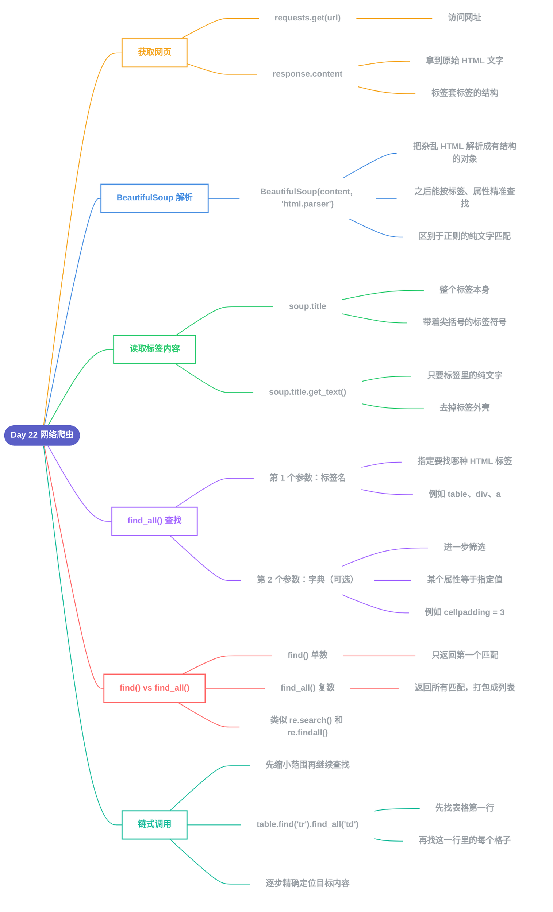

# Day 22 - 网络爬虫(Web Scraping)

---

## 补充说明

### 1. 获取网页原始内容
- `requests.get(url)`:访问网址,拿到服务器返回的数据
- `response.content`:网页的原始HTML文字(标签套标签的结构)

### 2. BeautifulSoup 解析
- `BeautifulSoup(content, 'html.parser')`:把杂乱的HTML文字,解析成一个有"层级结构"的对象
- 之后可以按标签名、属性,精准定位内容,而不是像正则表达式那样对纯文字做模式匹配

### 3. 标签 vs 纯文字
- `soup.title`:拿到整个标签(包含 `<title>` 和 `</title>` 符号本身)
- `soup.title.get_text()`:只拿标签里面包裹的纯文字内容

### 4. find_all() 的两个参数
| 参数 | 作用 |
|---|---|
| 第一个(字符串) | 指定要找哪种HTML标签(如 `table`、`div`、`a`) |
| 第二个(字典,可选) | 进一步筛选,要求该标签的某个属性等于指定值(如 `{'cellpadding': '3'}`) |

### 5. find() vs find_all()
- `find()`(单数):只返回**第一个**匹配的标签
- `find_all()`(复数):返回**所有**匹配的标签,打包成列表
- 与 Day18 的 `re.search()`(只返回第一个)和 `re.findall()`(返回所有)是同一种设计思路

### 6. 链式调用,逐步缩小范围
- 例:`table.find('tr').find_all('td')`
  1. 先用 `find('tr')` 找到表格的**第一行**
  2. 再用 `find_all('td')` 找出这一行里的**每一个格子**
- 这种"先定位大范围,再在范围内继续查找"的写法,是 BeautifulSoup 常见的用法

---

[⬅️ 上一天：Day 21 类和对象](Day21_类和对象.md) · [📚 目录](README.md)
