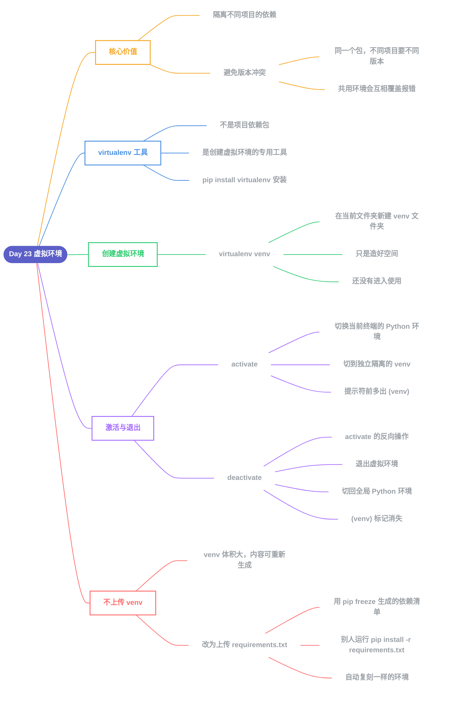

# Day 23 - 虚拟环境(Virtual Environment)

---

## 补充说明

### 1. 虚拟环境的核心价值
- 为每个项目创建**独立、隔离**的小环境
- 避免不同项目之间,因共用同一个Python环境而产生**版本冲突**(比如A项目要1.0版,B项目要2.0版,共用环境会互相覆盖)

### 2. virtualenv 工具
- `virtualenv` 本身**不是**某个项目要直接使用的功能包
- 它是一个专门用来"**创建虚拟环境**"的工具,通过 `pip install virtualenv` 安装

### 3. 创建虚拟环境
- `virtualenv venv`:在当前文件夹下,**新建**一个叫 `venv` 的文件夹
- 这一步只是"造好"独立环境的空间,人还**没有进入**使用

### 4. 激活(activate)与退出(deactivate)
| 命令 | 作用 |
|---|---|
| `source venv/bin/activate` | 把当前终端的Python环境,**切换**成这个独立隔离的虚拟环境;提示符前出现 `(venv)` |
| `deactivate` | `activate` 的反向操作,**退出**虚拟环境,切回电脑全局Python环境;`(venv)` 标记消失 |

### 5. 为什么不把 venv 上传到 GitHub
- `venv` 文件夹体积大,而且内容是"可以被重新生成"的
- 正确做法:上传一份轻量的 `requirements.txt`(用 `pip freeze` 生成的依赖清单)
- 别人拿到项目后,只需新建虚拟环境,运行 `pip install -r requirements.txt`,就能自动复刻出一模一样的环境,不用传输实际的包文件

---

[⬅️ 上一天：Day 22 网络爬虫](Day22_网络爬虫.md) · [📚 目录](README.md)
