# Day 24 - 统计与 NumPy(Statistics & NumPy)

```mermaid
%%{init: {'flowchart': {'curve': 'basis', 'nodeSpacing': 8, 'rankSpacing': 40}}}%%
flowchart LR
  R(["Day 24 统计与 NumPy"])
  R --- b0["基础"]
  b0 --- n1["import numpy as np"]
  subgraph sn1[" "]
  n1 --- n2["np 是 numpy 的别名"]
  n1 --- n3["Numerical Python 数值计算"]
  end
  style sn1 fill:none,stroke:none
  b0 --- n4["NumPy 数组 vs 列表"]
  subgraph sn4[" "]
  n4 --- n5["科学计算更高效"]
  n4 --- n6["元素必须同一 dtype"]
  n4 --- n7["大小创建后不能变"]
  n4 --- n8["支持向量化运算"]
  end
  style sn4 fill:none,stroke:none
  classDef c0 fill:none,stroke:#F5A623,stroke-width:2px,color:#F5A623,font-weight:bold
  class b0 c0
  R --- b1["向量化运算"]
  b1 --- n9["数组直接运算，不用循环"]
  b1 --- n10["arr + 10：每个元素加 10"]
  b1 --- n11["arr * 2：每个元素乘 2"]
  b1 --- n12["arr ** 2：每个元素平方"]
  b1 --- n13["打印时数字用空格隔开，没有逗号"]
  classDef c1 fill:none,stroke:#4A90E2,stroke-width:2px,color:#4A90E2,font-weight:bold
  class b1 c1
  R --- b2["形状与属性"]
  b2 --- n14["shape"]
  subgraph sn14[" "]
  n14 --- n15["(行数, 列数)"]
  n14 --- n16["一维数组是 (5,)"]
  end
  style sn14 fill:none,stroke:none
  b2 --- n17["size"]
  subgraph sn17[" "]
  n17 --- n18["元素总个数"]
  n17 --- n19["等于行数 × 列数"]
  end
  style sn17 fill:none,stroke:none
  b2 --- n20["dtype"]
  n20 --- n21["数据类型"]
  classDef c2 fill:none,stroke:#2ECC71,stroke-width:2px,color:#2ECC71,font-weight:bold
  class b2 c2
  R --- b3["索引与切片"]
  b3 --- n22["格式：arr[行范围, 列范围]"]
  subgraph sn22[" "]
  n22 --- n23["逗号前管行，逗号后管列"]
  n22 --- n24["单独的 : 表示全部"]
  end
  style sn22 fill:none,stroke:none
  b3 --- n25["切片左闭右开"]
  subgraph sn25[" "]
  n25 --- n26["0:2 取索引 0 和 1"]
  n25 --- n27["先展开成索引，再交叉取值"]
  n25 --- n28["用 shape 自检"]
  end
  style sn25 fill:none,stroke:none
  b3 --- n29["取行取列"]
  subgraph sn29[" "]
  n29 --- n30["arr[0] 是第 0 行"]
  n29 --- n31["arr[:, 0] 是第 0 列"]
  end
  style sn29 fill:none,stroke:none
  classDef c3 fill:none,stroke:#A66CFF,stroke-width:2px,color:#A66CFF,font-weight:bold
  class b3 c3
  R --- b4["创建与变形"]
  b4 --- n32["np.zeros() 全 0 数组"]
  b4 --- n33["np.ones() 全 1 数组"]
  n33 --- n34["括号里是 shape"]
  b4 --- n35["reshape"]
  subgraph sn35[" "]
  n35 --- n36["改变形状，顺序不变"]
  n35 --- n37["行 × 列必须等于 size"]
  n35 --- n38["否则报 ValueError"]
  end
  style sn35 fill:none,stroke:none
  b4 --- n39["flatten"]
  subgraph sn39[" "]
  n39 --- n40["拉平成一维"]
  n39 --- n41["reshape 的特殊情况"]
  end
  style sn39 fill:none,stroke:none
  classDef c4 fill:none,stroke:#FF6B6B,stroke-width:2px,color:#FF6B6B,font-weight:bold
  class b4 c4
  R --- b5["拼接与重复"]
  b5 --- n42["hstack"]
  subgraph sn42[" "]
  n42 --- n43["横向拼接，接成更长的一行"]
  n42 --- n44["shape 是 (6,)"]
  end
  style sn42 fill:none,stroke:none
  b5 --- n45["vstack"]
  subgraph sn45[" "]
  n45 --- n46["纵向拼接，每个数组叠成一行"]
  n45 --- n47["shape 是 (2, 3)"]
  end
  style sn45 fill:none,stroke:none
  b5 --- n48["tile"]
  n48 --- n49["整体重复：123123"]
  b5 --- n50["repeat"]
  n50 --- n51["逐个重复：112233"]
  classDef c5 fill:none,stroke:#1ABC9C,stroke-width:2px,color:#1ABC9C,font-weight:bold
  class b5 c5
  R --- b6["随机数"]
  b6 --- n52["random()：0 到 1 之间的小数"]
  b6 --- n53["randint(a, b)"]
  subgraph sn53[" "]
  n53 --- n54["整数，范围是 a 到 b-1"]
  n53 --- n55["size 指定个数"]
  end
  style sn53 fill:none,stroke:none
  b6 --- n56["normal(mu, sigma, size)"]
  subgraph sn56[" "]
  n56 --- n57["正态分布，集中在平均值附近"]
  n56 --- n58["mu 平均值，sigma 标准差"]
  end
  style sn56 fill:none,stroke:none
  classDef c6 fill:none,stroke:#F06292,stroke-width:2px,color:#F06292,font-weight:bold
  class b6 c6
  R --- b7["统计函数"]
  b7 --- n59["min / max：最小 / 最大"]
  b7 --- n60["mean：平均值"]
  n60 --- n61["会被极端值拉高或拉低"]
  b7 --- n62["median：中位数"]
  n62 --- n63["不受极端值影响"]
  b7 --- n64["axis"]
  subgraph sn64[" "]
  n64 --- n65["axis=0：每一列各得一个结果"]
  n64 --- n66["axis=1：每一行各得一个结果"]
  n64 --- n67["不写 axis：整个数组一个结果"]
  end
  style sn64 fill:none,stroke:none
  classDef c7 fill:none,stroke:#FFC107,stroke-width:2px,color:#FFC107,font-weight:bold
  class b7 c7
  R --- b8["线性代数"]
  b8 --- n68["np.dot 点积"]
  subgraph sn68[" "]
  n68 --- n69["对应位置相乘，再加起来"]
  n68 --- n70["结果是单个数字"]
  n68 --- n71["区别于 f * g：得到数组"]
  end
  style sn68 fill:none,stroke:none
  classDef c8 fill:none,stroke:#26C6DA,stroke-width:2px,color:#26C6DA,font-weight:bold
  class b8 c8
  classDef leaf fill:none,stroke:none,color:#9AA0A6
  classDef root fill:#5B5FC7,stroke:none,color:#fff,font-weight:bold
  class R root
  class n1,n2,n3,n4,n5,n6,n7,n8,n9,n10,n11,n12,n13,n14,n15,n16,n17,n18,n19,n20,n21,n22,n23,n24,n25,n26,n27,n28,n29,n30,n31,n32,n33,n34,n35,n36,n37,n38,n39,n40,n41,n42,n43,n44,n45,n46,n47,n48,n49,n50,n51,n52,n53,n54,n55,n56,n57,n58,n59,n60,n61,n62,n63,n64,n65,n66,n67,n68,n69,n70,n71 leaf
  linkStyle 0 stroke:#F5A623,stroke-width:1.5px
  linkStyle 1 stroke:#F5A623,stroke-width:1.5px
  linkStyle 2 stroke:#F5A623,stroke-width:1.5px
  linkStyle 3 stroke:#F5A623,stroke-width:1.5px
  linkStyle 4 stroke:#F5A623,stroke-width:1.5px
  linkStyle 5 stroke:#F5A623,stroke-width:1.5px
  linkStyle 6 stroke:#F5A623,stroke-width:1.5px
  linkStyle 7 stroke:#F5A623,stroke-width:1.5px
  linkStyle 8 stroke:#F5A623,stroke-width:1.5px
  linkStyle 9 stroke:#4A90E2,stroke-width:1.5px
  linkStyle 10 stroke:#4A90E2,stroke-width:1.5px
  linkStyle 11 stroke:#4A90E2,stroke-width:1.5px
  linkStyle 12 stroke:#4A90E2,stroke-width:1.5px
  linkStyle 13 stroke:#4A90E2,stroke-width:1.5px
  linkStyle 14 stroke:#4A90E2,stroke-width:1.5px
  linkStyle 15 stroke:#2ECC71,stroke-width:1.5px
  linkStyle 16 stroke:#2ECC71,stroke-width:1.5px
  linkStyle 17 stroke:#2ECC71,stroke-width:1.5px
  linkStyle 18 stroke:#2ECC71,stroke-width:1.5px
  linkStyle 19 stroke:#2ECC71,stroke-width:1.5px
  linkStyle 20 stroke:#2ECC71,stroke-width:1.5px
  linkStyle 21 stroke:#2ECC71,stroke-width:1.5px
  linkStyle 22 stroke:#2ECC71,stroke-width:1.5px
  linkStyle 23 stroke:#2ECC71,stroke-width:1.5px
  linkStyle 24 stroke:#A66CFF,stroke-width:1.5px
  linkStyle 25 stroke:#A66CFF,stroke-width:1.5px
  linkStyle 26 stroke:#A66CFF,stroke-width:1.5px
  linkStyle 27 stroke:#A66CFF,stroke-width:1.5px
  linkStyle 28 stroke:#A66CFF,stroke-width:1.5px
  linkStyle 29 stroke:#A66CFF,stroke-width:1.5px
  linkStyle 30 stroke:#A66CFF,stroke-width:1.5px
  linkStyle 31 stroke:#A66CFF,stroke-width:1.5px
  linkStyle 32 stroke:#A66CFF,stroke-width:1.5px
  linkStyle 33 stroke:#A66CFF,stroke-width:1.5px
  linkStyle 34 stroke:#A66CFF,stroke-width:1.5px
  linkStyle 35 stroke:#FF6B6B,stroke-width:1.5px
  linkStyle 36 stroke:#FF6B6B,stroke-width:1.5px
  linkStyle 37 stroke:#FF6B6B,stroke-width:1.5px
  linkStyle 38 stroke:#FF6B6B,stroke-width:1.5px
  linkStyle 39 stroke:#FF6B6B,stroke-width:1.5px
  linkStyle 40 stroke:#FF6B6B,stroke-width:1.5px
  linkStyle 41 stroke:#FF6B6B,stroke-width:1.5px
  linkStyle 42 stroke:#FF6B6B,stroke-width:1.5px
  linkStyle 43 stroke:#FF6B6B,stroke-width:1.5px
  linkStyle 44 stroke:#FF6B6B,stroke-width:1.5px
  linkStyle 45 stroke:#FF6B6B,stroke-width:1.5px
  linkStyle 46 stroke:#1ABC9C,stroke-width:1.5px
  linkStyle 47 stroke:#1ABC9C,stroke-width:1.5px
  linkStyle 48 stroke:#1ABC9C,stroke-width:1.5px
  linkStyle 49 stroke:#1ABC9C,stroke-width:1.5px
  linkStyle 50 stroke:#1ABC9C,stroke-width:1.5px
  linkStyle 51 stroke:#1ABC9C,stroke-width:1.5px
  linkStyle 52 stroke:#1ABC9C,stroke-width:1.5px
  linkStyle 53 stroke:#1ABC9C,stroke-width:1.5px
  linkStyle 54 stroke:#1ABC9C,stroke-width:1.5px
  linkStyle 55 stroke:#1ABC9C,stroke-width:1.5px
  linkStyle 56 stroke:#1ABC9C,stroke-width:1.5px
  linkStyle 57 stroke:#F06292,stroke-width:1.5px
  linkStyle 58 stroke:#F06292,stroke-width:1.5px
  linkStyle 59 stroke:#F06292,stroke-width:1.5px
  linkStyle 60 stroke:#F06292,stroke-width:1.5px
  linkStyle 61 stroke:#F06292,stroke-width:1.5px
  linkStyle 62 stroke:#F06292,stroke-width:1.5px
  linkStyle 63 stroke:#F06292,stroke-width:1.5px
  linkStyle 64 stroke:#F06292,stroke-width:1.5px
  linkStyle 65 stroke:#FFC107,stroke-width:1.5px
  linkStyle 66 stroke:#FFC107,stroke-width:1.5px
  linkStyle 67 stroke:#FFC107,stroke-width:1.5px
  linkStyle 68 stroke:#FFC107,stroke-width:1.5px
  linkStyle 69 stroke:#FFC107,stroke-width:1.5px
  linkStyle 70 stroke:#FFC107,stroke-width:1.5px
  linkStyle 71 stroke:#FFC107,stroke-width:1.5px
  linkStyle 72 stroke:#FFC107,stroke-width:1.5px
  linkStyle 73 stroke:#FFC107,stroke-width:1.5px
  linkStyle 74 stroke:#FFC107,stroke-width:1.5px
  linkStyle 75 stroke:#26C6DA,stroke-width:1.5px
  linkStyle 76 stroke:#26C6DA,stroke-width:1.5px
  linkStyle 77 stroke:#26C6DA,stroke-width:1.5px
  linkStyle 78 stroke:#26C6DA,stroke-width:1.5px
  linkStyle 79 stroke:#26C6DA,stroke-width:1.5px
```

---

## 补充说明

### 1. NumPy 基础
- `import numpy as np`:`np` 是 numpy 的别名,省得每次写全名
- NumPy 数组(ndarray)和列表的区别:元素必须是同一种数据类型(dtype)、创建后大小不能变、支持向量化运算,科学计算更高效

### 2. 向量化运算
- 数组可以直接做运算,不用写循环:`arr + 10`(每个元素加10)、`arr * 2`(每个元素乘2)、`arr ** 2`(每个元素平方)
- 打印数组时数字之间用**空格**隔开,没有逗号(这是和列表的外观区别)

### 3. shape 与 size
| 属性 | 含义 | 例子 |
|---|---|---|
| `shape` | (行数, 列数) | 2行3列 → `(2, 3)` |
| `size` | 元素总个数 = 行数 × 列数 | 上例 → `6` |
| 一维数组的 shape | 带逗号的单元素元组 | 5个元素 → `(5,)` |

### 4. 索引与切片
- 格式:`arr[行范围, 列范围]`,逗号前管行,逗号后管列;单独一个 `:` 表示"全部"
- 切片是**左闭右开**:`0:2` 取索引 0 和 1
- 三步法:
  1. 把行范围展开成行索引
  2. 把列范围展开成列索引
  3. 取交叉位置,并用 shape 自检
- 例:`two_dim[1:3, 1:3]` → 行 1、2 / 列 1、2 → 右下角 2×2 的小块
- `arr[0]` 是第 0 行;`arr[:, 0]` 是第 0 列

### 5. 创建与变形
- `np.zeros(shape)`:全 0 数组;`np.ones(shape)`:全 1 数组(元素是数字 0/1,不是布尔值)
- `reshape`:改变形状,元素顺序不变;**行 × 列必须等于 size**,否则报 `ValueError`
- `flatten`:拉平成一维(6个元素 → shape `(6,)`),是 reshape 的特殊情况

### 6. 拼接与重复
| 函数 | 作用 | 例子 | 结果 shape |
|---|---|---|---|
| `hstack` | 横向拼接,接成更长的一行 | `[1 2]`、`[3 4]` → `[1 2 3 4]` | `(4,)` |
| `vstack` | 纵向拼接,每个数组叠成一行 | `[1 2]`、`[3 4]` → `[[1 2] [3 4]]` | `(2, 2)` |
| `tile` | **整体**重复 | `[1 2 3]` ×2 → `[1 2 3 1 2 3]` | `(6,)` |
| `repeat` | **逐个**重复 | `[1 2 3]` ×2 → `[1 1 2 2 3 3]` | `(6,)` |

### 7. 随机数
| 函数 | 作用 |
|---|---|
| `np.random.random()` | 0 到 1 之间的小数 |
| `np.random.randint(a, b)` | 整数,范围是 a 到 b-1;`size=` 指定个数 |
| `np.random.normal(mu, sigma, size)` | 正态分布,数据集中在平均值附近;mu 是平均值,sigma 是标准差 |

### 8. 统计函数与 axis
- `min` / `max`:最小 / 最大;`mean`:平均值;`median`:中位数
- 例:`[1, 2, 3, 4, 100]` → mean = 22.0(被极端值 100 拉高),median = 3(不受极端值影响)
- `axis` 的含义:
  - 不写 axis:整个数组得到**一个**结果
  - `axis=0`:每一**列**各得一个结果
  - `axis=1`:每一**行**各得一个结果

### 9. 点积 np.dot
- 对应位置相乘,再全部加起来,结果是**单个数字**
- 例:`[1, 2, 3] · [4, 5, 6]` = 1×4 + 2×5 + 3×6 = 32
- 区别:`f * g` 是对应位置相乘,得到的是**数组**,不是单个数字

---

[⬅️ 上一天：Day 23 虚拟环境](Day23_虚拟环境.md) · [📚 目录](README.md)
