# Day 25 - Pandas

```mermaid
%%{init: {'flowchart': {'curve': 'basis', 'nodeSpacing': 8, 'rankSpacing': 40}}}%%
flowchart LR
  R(["Day 25 Pandas"])
  R --- b0["基础"]
  b0 --- n1["import pandas as pd"]
  subgraph sn1[" "]
  n1 --- n2["pd 是 pandas 的别名"]
  n1 --- n3["处理表格数据，像 Python 里的 Excel"]
  end
  style sn1 fill:none,stroke:none
  b0 --- n4["两个核心结构"]
  subgraph sn4[" "]
  n4 --- n5["Series：一列数据"]
  n4 --- n6["DataFrame：整张表格"]
  n4 --- n7["DataFrame 由多列 Series 拼成"]
  end
  style sn4 fill:none,stroke:none
  classDef c0 fill:none,stroke:#F5A623,stroke-width:2px,color:#F5A623,font-weight:bold
  class b0 c0
  R --- b1["Series"]
  b1 --- n8["索引 index"]
  subgraph sn8[" "]
  n8 --- n9["左边的编号，每一行的座位号"]
  n8 --- n10["默认是 0 1 2"]
  n8 --- n11["用 index 参数自定义"]
  n8 --- n12["index=['a', 'b', 'c']"]
  end
  style sn8 fill:none,stroke:none
  b1 --- n13["dtype"]
  subgraph sn13[" "]
  n13 --- n14["右边数据的类型"]
  n13 --- n15["与索引无关"]
  end
  style sn13 fill:none,stroke:none
  b1 --- n16["用列表创建"]
  subgraph sn16[" "]
  n16 --- n17["索引默认 0 1 2"]
  n16 --- n18["或用 index 指定"]
  end
  style sn16 fill:none,stroke:none
  b1 --- n19["用字典创建"]
  subgraph sn19[" "]
  n19 --- n20["key 变索引"]
  n19 --- n21["value 变数据"]
  n19 --- n22["不会再多出 0 1 2"]
  end
  style sn19 fill:none,stroke:none
  b1 --- n23["按索引取值"]
  n23 --- n24["s['b'] 取到 b 对应的数据"]
  classDef c1 fill:none,stroke:#4A90E2,stroke-width:2px,color:#4A90E2,font-weight:bold
  class b1 c1
  R --- b2["DataFrame 创建"]
  b2 --- n25["用字典创建"]
  subgraph sn25[" "]
  n25 --- n26["key 变列名"]
  n25 --- n27["每个 value 是一列数据"]
  n25 --- n28["每列长度必须一样"]
  end
  style sn25 fill:none,stroke:none
  b2 --- n29["左边的行索引"]
  n29 --- n30["默认自动生成 0 1 2"]
  classDef c2 fill:none,stroke:#2ECC71,stroke-width:2px,color:#2ECC71,font-weight:bold
  class b2 c2
  R --- b3["读取 CSV"]
  b3 --- n31["pd.read_csv('文件名')"]
  subgraph sn31[" "]
  n31 --- n32["CSV 是逗号隔开的表格文件"]
  n31 --- n33["读出来是 DataFrame"]
  end
  style sn31 fill:none,stroke:none
  b3 --- n34["head()"]
  n34 --- n35["看前 5 行"]
  b3 --- n36["tail()"]
  n36 --- n37["看后 5 行"]
  b3 --- n38["括号里写数字"]
  n38 --- n39["head(10) 看前 10 行"]
  classDef c3 fill:none,stroke:#A66CFF,stroke-width:2px,color:#A66CFF,font-weight:bold
  class b3 c3
  R --- b4["表格体检"]
  b4 --- n40["shape"]
  subgraph sn40[" "]
  n40 --- n41["(行数, 列数)"]
  n40 --- n42["属性，不带括号"]
  end
  style sn40 fill:none,stroke:none
  b4 --- n43["columns"]
  subgraph sn43[" "]
  n43 --- n44["所有列名"]
  n43 --- n45["属性，不带括号"]
  end
  style sn43 fill:none,stroke:none
  b4 --- n46["df['列名']"]
  n46 --- n47["取出一列，得到 Series"]
  b4 --- n48["describe()"]
  subgraph sn48[" "]
  n48 --- n49["数值列的统计摘要"]
  n48 --- n50["方法，带括号"]
  end
  style sn48 fill:none,stroke:none
  b4 --- n51["df['列名'].describe()"]
  subgraph sn51[" "]
  n51 --- n52["先取一列，再统计"]
  n51 --- n53["一步接一步连写"]
  end
  style sn51 fill:none,stroke:none
  classDef c4 fill:none,stroke:#FF6B6B,stroke-width:2px,color:#FF6B6B,font-weight:bold
  class b4 c4
  R --- b5["添加与修改列"]
  b5 --- n54["df['列名'] = 内容"]
  b5 --- n55["列名已存在"]
  subgraph sn55[" "]
  n55 --- n56["覆盖旧数据"]
  n55 --- n57["列还在，数据被换新"]
  end
  style sn55 fill:none,stroke:none
  b5 --- n58["列名不存在"]
  n58 --- n59["不报错，自动新建一列"]
  b5 --- n60["整列批量运算"]
  subgraph sn60[" "]
  n60 --- n61["不用循环"]
  n60 --- n62["多列之间可以直接计算"]
  end
  style sn60 fill:none,stroke:none
  b5 --- n63["想保留旧数据"]
  n63 --- n64["用新列名"]
  classDef c5 fill:none,stroke:#1ABC9C,stroke-width:2px,color:#1ABC9C,font-weight:bold
  class b5 c5
  R --- b6["数据类型"]
  b6 --- n65["dtype"]
  n65 --- n66["查看类型，不带括号"]
  b6 --- n67["astype()"]
  subgraph sn67[" "]
  n67 --- n68["转换类型，带括号"]
  n67 --- n69["astype('int') 转整数"]
  n67 --- n70["直接砍掉小数，不四舍五入"]
  n67 --- n71["要四舍五入先用 round()"]
  end
  style sn67 fill:none,stroke:none
  classDef c6 fill:none,stroke:#F06292,stroke-width:2px,color:#F06292,font-weight:bold
  class b6 c6
  R --- b7["布尔索引"]
  b7 --- n72["df[条件] 筛选行"]
  subgraph sn72[" "]
  n72 --- n73["第一步：得到 True / False"]
  n72 --- n74["第二步：只留 True 的行"]
  end
  style sn72 fill:none,stroke:none
  b7 --- n75["行号保持原样"]
  n75 --- n76["不会重新从 0 开始"]
  classDef c7 fill:none,stroke:#FFC107,stroke-width:2px,color:#FFC107,font-weight:bold
  class b7 c7
  classDef leaf fill:none,stroke:none,color:#9AA0A6
  classDef root fill:#5B5FC7,stroke:none,color:#fff,font-weight:bold
  class R root
  class n1,n2,n3,n4,n5,n6,n7,n8,n9,n10,n11,n12,n13,n14,n15,n16,n17,n18,n19,n20,n21,n22,n23,n24,n25,n26,n27,n28,n29,n30,n31,n32,n33,n34,n35,n36,n37,n38,n39,n40,n41,n42,n43,n44,n45,n46,n47,n48,n49,n50,n51,n52,n53,n54,n55,n56,n57,n58,n59,n60,n61,n62,n63,n64,n65,n66,n67,n68,n69,n70,n71,n72,n73,n74,n75,n76 leaf
  linkStyle 0 stroke:#F5A623,stroke-width:1.5px
  linkStyle 1 stroke:#F5A623,stroke-width:1.5px
  linkStyle 2 stroke:#F5A623,stroke-width:1.5px
  linkStyle 3 stroke:#F5A623,stroke-width:1.5px
  linkStyle 4 stroke:#F5A623,stroke-width:1.5px
  linkStyle 5 stroke:#F5A623,stroke-width:1.5px
  linkStyle 6 stroke:#F5A623,stroke-width:1.5px
  linkStyle 7 stroke:#F5A623,stroke-width:1.5px
  linkStyle 8 stroke:#4A90E2,stroke-width:1.5px
  linkStyle 9 stroke:#4A90E2,stroke-width:1.5px
  linkStyle 10 stroke:#4A90E2,stroke-width:1.5px
  linkStyle 11 stroke:#4A90E2,stroke-width:1.5px
  linkStyle 12 stroke:#4A90E2,stroke-width:1.5px
  linkStyle 13 stroke:#4A90E2,stroke-width:1.5px
  linkStyle 14 stroke:#4A90E2,stroke-width:1.5px
  linkStyle 15 stroke:#4A90E2,stroke-width:1.5px
  linkStyle 16 stroke:#4A90E2,stroke-width:1.5px
  linkStyle 17 stroke:#4A90E2,stroke-width:1.5px
  linkStyle 18 stroke:#4A90E2,stroke-width:1.5px
  linkStyle 19 stroke:#4A90E2,stroke-width:1.5px
  linkStyle 20 stroke:#4A90E2,stroke-width:1.5px
  linkStyle 21 stroke:#4A90E2,stroke-width:1.5px
  linkStyle 22 stroke:#4A90E2,stroke-width:1.5px
  linkStyle 23 stroke:#4A90E2,stroke-width:1.5px
  linkStyle 24 stroke:#4A90E2,stroke-width:1.5px
  linkStyle 25 stroke:#4A90E2,stroke-width:1.5px
  linkStyle 26 stroke:#2ECC71,stroke-width:1.5px
  linkStyle 27 stroke:#2ECC71,stroke-width:1.5px
  linkStyle 28 stroke:#2ECC71,stroke-width:1.5px
  linkStyle 29 stroke:#2ECC71,stroke-width:1.5px
  linkStyle 30 stroke:#2ECC71,stroke-width:1.5px
  linkStyle 31 stroke:#2ECC71,stroke-width:1.5px
  linkStyle 32 stroke:#2ECC71,stroke-width:1.5px
  linkStyle 33 stroke:#A66CFF,stroke-width:1.5px
  linkStyle 34 stroke:#A66CFF,stroke-width:1.5px
  linkStyle 35 stroke:#A66CFF,stroke-width:1.5px
  linkStyle 36 stroke:#A66CFF,stroke-width:1.5px
  linkStyle 37 stroke:#A66CFF,stroke-width:1.5px
  linkStyle 38 stroke:#A66CFF,stroke-width:1.5px
  linkStyle 39 stroke:#A66CFF,stroke-width:1.5px
  linkStyle 40 stroke:#A66CFF,stroke-width:1.5px
  linkStyle 41 stroke:#A66CFF,stroke-width:1.5px
  linkStyle 42 stroke:#A66CFF,stroke-width:1.5px
  linkStyle 43 stroke:#FF6B6B,stroke-width:1.5px
  linkStyle 44 stroke:#FF6B6B,stroke-width:1.5px
  linkStyle 45 stroke:#FF6B6B,stroke-width:1.5px
  linkStyle 46 stroke:#FF6B6B,stroke-width:1.5px
  linkStyle 47 stroke:#FF6B6B,stroke-width:1.5px
  linkStyle 48 stroke:#FF6B6B,stroke-width:1.5px
  linkStyle 49 stroke:#FF6B6B,stroke-width:1.5px
  linkStyle 50 stroke:#FF6B6B,stroke-width:1.5px
  linkStyle 51 stroke:#FF6B6B,stroke-width:1.5px
  linkStyle 52 stroke:#FF6B6B,stroke-width:1.5px
  linkStyle 53 stroke:#FF6B6B,stroke-width:1.5px
  linkStyle 54 stroke:#FF6B6B,stroke-width:1.5px
  linkStyle 55 stroke:#FF6B6B,stroke-width:1.5px
  linkStyle 56 stroke:#FF6B6B,stroke-width:1.5px
  linkStyle 57 stroke:#FF6B6B,stroke-width:1.5px
  linkStyle 58 stroke:#1ABC9C,stroke-width:1.5px
  linkStyle 59 stroke:#1ABC9C,stroke-width:1.5px
  linkStyle 60 stroke:#1ABC9C,stroke-width:1.5px
  linkStyle 61 stroke:#1ABC9C,stroke-width:1.5px
  linkStyle 62 stroke:#1ABC9C,stroke-width:1.5px
  linkStyle 63 stroke:#1ABC9C,stroke-width:1.5px
  linkStyle 64 stroke:#1ABC9C,stroke-width:1.5px
  linkStyle 65 stroke:#1ABC9C,stroke-width:1.5px
  linkStyle 66 stroke:#1ABC9C,stroke-width:1.5px
  linkStyle 67 stroke:#1ABC9C,stroke-width:1.5px
  linkStyle 68 stroke:#1ABC9C,stroke-width:1.5px
  linkStyle 69 stroke:#1ABC9C,stroke-width:1.5px
  linkStyle 70 stroke:#F06292,stroke-width:1.5px
  linkStyle 71 stroke:#F06292,stroke-width:1.5px
  linkStyle 72 stroke:#F06292,stroke-width:1.5px
  linkStyle 73 stroke:#F06292,stroke-width:1.5px
  linkStyle 74 stroke:#F06292,stroke-width:1.5px
  linkStyle 75 stroke:#F06292,stroke-width:1.5px
  linkStyle 76 stroke:#F06292,stroke-width:1.5px
  linkStyle 77 stroke:#F06292,stroke-width:1.5px
  linkStyle 78 stroke:#FFC107,stroke-width:1.5px
  linkStyle 79 stroke:#FFC107,stroke-width:1.5px
  linkStyle 80 stroke:#FFC107,stroke-width:1.5px
  linkStyle 81 stroke:#FFC107,stroke-width:1.5px
  linkStyle 82 stroke:#FFC107,stroke-width:1.5px
  linkStyle 83 stroke:#FFC107,stroke-width:1.5px
```



---

## 补充说明

### 1. Pandas 基础
- `import pandas as pd`:`pd` 是别名,Pandas 用来处理表格数据,就像在 Python 里用 Excel
- 两个核心结构:
  - **Series**:一列数据
  - **DataFrame**:整张表格,由很多列 Series 拼成

### 2. Series 的索引
- 左边的编号叫**索引(index)**,相当于每一行的"座位号"或"名字"
- 默认索引是 0、1、2,可以用 `index=` 自己指定:
  ```python
  pd.Series([1, 2, 3], index=['a', 'b', 'c'])
  ```
- 右边数据的类型叫 **dtype**,和索引无关(改索引不会改 dtype)
- 按索引取值:`s['b']` 取到索引 `b` 对应的数据

### 3. 用字典创建 Series
| 创建方式 | 索引从哪来 |
|---|---|
| 列表 `[10, 20]` | 默认 0、1、2,或用 `index=` 自己指定 |
| 字典 `{'Lin': 95}` | 字典的 key 自动变成索引,value 变数据 |

- 字典创建时**不会**再多出 0、1、2,默认编号只在"用列表创建、又没写 `index=`"时出现

### 4. 创建 DataFrame
```python
data = {
    'Name': ['Lin', 'Tom'],
    'Age': [20, 25],
    'City': ['Madrid', 'Rome']
}
df = pd.DataFrame(data)
```
- 字典的 **key 变列名**,每个列表变成**一列数据**
- **每一列的长度必须一样**,就像 Excel 里不能有一列比别的列短

### 5. 读取 CSV 与查看数据
- `pd.read_csv('文件名.csv')`:读出来的是 DataFrame
- `df.head()` 看**前** 5 行,`df.tail()` 看**后** 5 行;括号里写数字可改行数,如 `df.head(10)`

### 6. 表格"体检"
| 写法 | 作用 | 是否带括号 |
|---|---|---|
| `df.shape` | (行数, 列数),如 `(10000, 3)` | 不带(属性) |
| `df.columns` | 所有列名 | 不带(属性) |
| `df['Height']` | 取出这一列的原始数据(Series) | — |
| `df.describe()` | 数值列的统计摘要 | 带(方法) |
| `df['Height'].describe()` | 只对这一列做统计摘要 | 带(方法) |

- `df['Height']` 是**原始数据**,`describe()` 是**统计结果**,别混了
- `df['Height'].describe()` 是两步连写:先取列,再统计(和 Day22 的 `table.find('tr').find_all('td')` 是同一种思路)

### 7. 添加和修改列
```python
df['City'] = ['Madrid', 'Rome']                 # 新增一列
df['Height'] = df['Height'] * 0.0254            # 整列批量运算
df['BMI'] = df['Weight'] / df['Height'] ** 2    # 用已有的列算出新列
```
| 等号左边的列名 | 结果 |
|---|---|
| 已存在 | **覆盖**旧数据(列还在,里面的数据被换成新结果,旧数据找不回来) |
| 不存在 | **新建**一列,不报错 |

- 规则和字典 `d['a'] = 5` 一模一样
- 想保留原数据,就用新列名:`df['Height_m'] = df['Height'] * 0.0254`

### 8. 数据类型
- `df['Age'].dtype`:**查看**类型(不带括号)
- `df['Age'].astype('int')`:**转换**成整数(带括号)
- 转整数时会直接**砍掉小数部分**,不是四舍五入:`20.7` 和 `20.9` 都变成 `20`;想四舍五入要先用 `round()`

### 9. 布尔索引(按条件筛选行)
```python
df[df['Age'] > 20]
```
拆成两步:
1. `df['Age'] > 20` 对每一行判断,得到一列 `True / False`
2. 外层 `df[...]` 只保留 `True` 的行

- 筛选后的行**保留原来的行号**(比如留下 Tom 和 Ana,行号是 1、2,不会重新从 0 开始)


---

[⬅️ 上一天：Day 24 统计与NumPy](Day24_统计与NumPy.md) · [📚 目录](README.md) · [下一天：Day 26 Flask网页开发 ➡️](Day26_Flask网页开发.md)
