# Day 26 - Python Web(Flask)

```mermaid
%%{init: {'flowchart': {'curve': 'basis', 'nodeSpacing': 8, 'rankSpacing': 40}}}%%
flowchart LR
  R(["Day 26 Flask 网站"])
  R --- b0["基础"]
  b0 --- n1["Web 框架"]
  subgraph sn1[" "]
  n1 --- n2["别人写好的工具和脚手架"]
  n1 --- n3["省去重复劳动"]
  end
  style sn1 fill:none,stroke:none
  b0 --- n4["Flask"]
  subgraph sn4[" "]
  n4 --- n5["轻量、简单，适合入门"]
  n4 --- n6["另一个常见框架 Django，更全更复杂"]
  end
  style sn4 fill:none,stroke:none
  b0 --- n7["准备工作"]
  subgraph sn7[" "]
  n7 --- n8["先建虚拟环境，再装 Flask"]
  n7 --- n9["virtualenv venv"]
  n7 --- n10["source venv/bin/activate"]
  n7 --- n11["激活后出现 (venv)"]
  n7 --- n12["目的：隔离项目的包，避免版本冲突"]
  end
  style sn7 fill:none,stroke:none
  classDef c0 fill:none,stroke:#F5A623,stroke-width:2px,color:#F5A623,font-weight:bold
  class b0 c0
  R --- b1["路由 Route"]
  b1 --- n13["app = Flask(__name__)"]
  b1 --- n14["装饰器 @app.route('路径')"]
  subgraph sn14[" "]
  n14 --- n15["访问这个网址，就执行下面的函数"]
  n14 --- n16["装饰器写在函数正上方"]
  end
  style sn14 fill:none,stroke:none
  b1 --- n17["函数 return 的内容"]
  n17 --- n18["就是浏览器里看到的页面"]
  b1 --- n19["新增页面"]
  subgraph sn19[" "]
  n19 --- n20["新写一个函数"]
  n19 --- n21["再用 @app.route 连起来"]
  end
  style sn19 fill:none,stroke:none
  b1 --- n22["app.run()"]
  subgraph sn22[" "]
  n22 --- n23["启动网站"]
  n22 --- n24["默认本机 5000 端口"]
  end
  style sn22 fill:none,stroke:none
  classDef c1 fill:none,stroke:#4A90E2,stroke-width:2px,color:#4A90E2,font-weight:bold
  class b1 c1
  R --- b2["模板 Template"]
  b2 --- n25["HTML 单独放进文件"]
  n25 --- n26["Python 和 HTML 不混在一起"]
  b2 --- n27["必须放在 templates 文件夹"]
  subgraph sn27[" "]
  n27 --- n28["名字固定，复数，有 s"]
  n27 --- n29["放错会报 TemplateNotFound"]
  end
  style sn27 fill:none,stroke:none
  b2 --- n30["render_template"]
  subgraph sn30[" "]
  n30 --- n31["找到 HTML 文件并返回"]
  n30 --- n32["要先从 flask 导入"]
  end
  style sn30 fill:none,stroke:none
  classDef c2 fill:none,stroke:#2ECC71,stroke-width:2px,color:#2ECC71,font-weight:bold
  class b2 c2
  R --- b3["Jinja2"]
  b3 --- n33["两种括号"]
  subgraph sn33[" "]
  n33 --- n34["{{ }} 显示值，填空"]
  n33 --- n35["{% %} 写逻辑，指令"]
  end
  style sn33 fill:none,stroke:none
  b3 --- n36["传数据"]
  subgraph sn36[" "]
  n36 --- n37["render_template(..., name=name)"]
  n36 --- n38["Python 变量传进 HTML"]
  end
  style sn36 fill:none,stroke:none
  b3 --- n39["for 循环"]
  subgraph sn39[" "]
  n39 --- n40["{% for tech in techs %}"]
  n39 --- n41["用 {% endfor %} 结尾"]
  n39 --- n42["列表有几项就生成几项"]
  end
  style sn39 fill:none,stroke:none
  classDef c3 fill:none,stroke:#A66CFF,stroke-width:2px,color:#A66CFF,font-weight:bold
  class b3 c3
  R --- b4["导航 url_for"]
  b4 --- n43["url_for('函数名')"]
  subgraph sn43[" "]
  n43 --- n44["括号里是函数名，不是网址"]
  n43 --- n45["放在 {{ }} 里，因为要显示生成的网址"]
  end
  style sn43 fill:none,stroke:none
  b4 --- n46["好处"]
  subgraph sn46[" "]
  n46 --- n47["改网址只改 route 一处"]
  n46 --- n48["模板里的链接自动跟着变"]
  end
  style sn46 fill:none,stroke:none
  classDef c4 fill:none,stroke:#FF6B6B,stroke-width:2px,color:#FF6B6B,font-weight:bold
  class b4 c4
  R --- b5["模板继承"]
  b5 --- n49["layout.html"]
  subgraph sn49[" "]
  n49 --- n50["公共骨架，像 PPT 母版"]
  n49 --- n51["导航栏写一次，所有页面都有"]
  end
  style sn49 fill:none,stroke:none
  b5 --- n52["{% block content %}"]
  n52 --- n53["在母版里留一个空位"]
  b5 --- n54["{% extends 'layout.html' %}"]
  subgraph sn54[" "]
  n54 --- n55["子页面继承母版"]
  n54 --- n56["只写自己独有的内容"]
  end
  style sn54 fill:none,stroke:none
  b5 --- n57["注意"]
  subgraph sn57[" "]
  n57 --- n58["block content 和表单的 name='content'"]
  n57 --- n59["只是同名，毫无关系"]
  end
  style sn57 fill:none,stroke:none
  classDef c5 fill:none,stroke:#1ABC9C,stroke-width:2px,color:#1ABC9C,font-weight:bold
  class b5 c5
  R --- b6["静态文件 static"]
  b6 --- n60["放不变的文件"]
  n60 --- n61["CSS、图片、JS"]
  b6 --- n62["引入 CSS"]
  subgraph sn62[" "]
  n62 --- n63["url_for('static', filename=...)"]
  n62 --- n64["filename 是相对 static 的路径"]
  end
  style sn62 fill:none,stroke:none
  classDef c6 fill:none,stroke:#F06292,stroke-width:2px,color:#F06292,font-weight:bold
  class b6 c6
  R --- b7["GET 与 POST"]
  b7 --- n65["GET"]
  subgraph sn65[" "]
  n65 --- n66["获取页面"]
  n65 --- n67["像领一张空白表格"]
  end
  style sn65 fill:none,stroke:none
  b7 --- n68["POST"]
  subgraph sn68[" "]
  n68 --- n69["提交数据"]
  n68 --- n70["像交回填好的表格"]
  end
  style sn68 fill:none,stroke:none
  b7 --- n71["目的不同，动作都是向服务器请求"]
  b7 --- n72["代码写法"]
  subgraph sn72[" "]
  n72 --- n73["methods=['GET', 'POST']"]
  n72 --- n74["request.method 判断是哪种"]
  n72 --- n75["request.form['name'] 读取表单内容"]
  n72 --- n76["redirect(url_for(...)) 跳转到别的页面"]
  end
  style sn72 fill:none,stroke:none
  b7 --- n77["对应关系"]
  subgraph sn77[" "]
  n77 --- n78["request.form 里的名字"]
  n77 --- n79["对应 HTML 输入框的 name"]
  end
  style sn77 fill:none,stroke:none
  classDef c7 fill:none,stroke:#FFC107,stroke-width:2px,color:#FFC107,font-weight:bold
  class b7 c7
  R --- b8["部署"]
  b8 --- n80["把网站放到互联网服务器"]
  b8 --- n81["requirements.txt"]
  subgraph sn81[" "]
  n81 --- n82["包和版本的完整清单"]
  n81 --- n83["服务器照着清单自己安装"]
  end
  style sn81 fill:none,stroke:none
  b8 --- n84["Procfile"]
  subgraph sn84[" "]
  n84 --- n85["web: python app.py"]
  n84 --- n86["启动命令"]
  n84 --- n87["服务器自己执行"]
  end
  style sn84 fill:none,stroke:none
  b8 --- n88["Heroku 免费版已取消"]
  n88 --- n89["先了解流程即可"]
  classDef c8 fill:none,stroke:#26C6DA,stroke-width:2px,color:#26C6DA,font-weight:bold
  class b8 c8
  classDef leaf fill:none,stroke:none,color:#9AA0A6
  classDef root fill:#5B5FC7,stroke:none,color:#fff,font-weight:bold
  class R root
  class n1,n2,n3,n4,n5,n6,n7,n8,n9,n10,n11,n12,n13,n14,n15,n16,n17,n18,n19,n20,n21,n22,n23,n24,n25,n26,n27,n28,n29,n30,n31,n32,n33,n34,n35,n36,n37,n38,n39,n40,n41,n42,n43,n44,n45,n46,n47,n48,n49,n50,n51,n52,n53,n54,n55,n56,n57,n58,n59,n60,n61,n62,n63,n64,n65,n66,n67,n68,n69,n70,n71,n72,n73,n74,n75,n76,n77,n78,n79,n80,n81,n82,n83,n84,n85,n86,n87,n88,n89 leaf
  linkStyle 0 stroke:#F5A623,stroke-width:1.5px
  linkStyle 1 stroke:#F5A623,stroke-width:1.5px
  linkStyle 2 stroke:#F5A623,stroke-width:1.5px
  linkStyle 3 stroke:#F5A623,stroke-width:1.5px
  linkStyle 4 stroke:#F5A623,stroke-width:1.5px
  linkStyle 5 stroke:#F5A623,stroke-width:1.5px
  linkStyle 6 stroke:#F5A623,stroke-width:1.5px
  linkStyle 7 stroke:#F5A623,stroke-width:1.5px
  linkStyle 8 stroke:#F5A623,stroke-width:1.5px
  linkStyle 9 stroke:#F5A623,stroke-width:1.5px
  linkStyle 10 stroke:#F5A623,stroke-width:1.5px
  linkStyle 11 stroke:#F5A623,stroke-width:1.5px
  linkStyle 12 stroke:#F5A623,stroke-width:1.5px
  linkStyle 13 stroke:#4A90E2,stroke-width:1.5px
  linkStyle 14 stroke:#4A90E2,stroke-width:1.5px
  linkStyle 15 stroke:#4A90E2,stroke-width:1.5px
  linkStyle 16 stroke:#4A90E2,stroke-width:1.5px
  linkStyle 17 stroke:#4A90E2,stroke-width:1.5px
  linkStyle 18 stroke:#4A90E2,stroke-width:1.5px
  linkStyle 19 stroke:#4A90E2,stroke-width:1.5px
  linkStyle 20 stroke:#4A90E2,stroke-width:1.5px
  linkStyle 21 stroke:#4A90E2,stroke-width:1.5px
  linkStyle 22 stroke:#4A90E2,stroke-width:1.5px
  linkStyle 23 stroke:#4A90E2,stroke-width:1.5px
  linkStyle 24 stroke:#4A90E2,stroke-width:1.5px
  linkStyle 25 stroke:#4A90E2,stroke-width:1.5px
  linkStyle 26 stroke:#2ECC71,stroke-width:1.5px
  linkStyle 27 stroke:#2ECC71,stroke-width:1.5px
  linkStyle 28 stroke:#2ECC71,stroke-width:1.5px
  linkStyle 29 stroke:#2ECC71,stroke-width:1.5px
  linkStyle 30 stroke:#2ECC71,stroke-width:1.5px
  linkStyle 31 stroke:#2ECC71,stroke-width:1.5px
  linkStyle 32 stroke:#2ECC71,stroke-width:1.5px
  linkStyle 33 stroke:#2ECC71,stroke-width:1.5px
  linkStyle 34 stroke:#2ECC71,stroke-width:1.5px
  linkStyle 35 stroke:#A66CFF,stroke-width:1.5px
  linkStyle 36 stroke:#A66CFF,stroke-width:1.5px
  linkStyle 37 stroke:#A66CFF,stroke-width:1.5px
  linkStyle 38 stroke:#A66CFF,stroke-width:1.5px
  linkStyle 39 stroke:#A66CFF,stroke-width:1.5px
  linkStyle 40 stroke:#A66CFF,stroke-width:1.5px
  linkStyle 41 stroke:#A66CFF,stroke-width:1.5px
  linkStyle 42 stroke:#A66CFF,stroke-width:1.5px
  linkStyle 43 stroke:#A66CFF,stroke-width:1.5px
  linkStyle 44 stroke:#A66CFF,stroke-width:1.5px
  linkStyle 45 stroke:#A66CFF,stroke-width:1.5px
  linkStyle 46 stroke:#FF6B6B,stroke-width:1.5px
  linkStyle 47 stroke:#FF6B6B,stroke-width:1.5px
  linkStyle 48 stroke:#FF6B6B,stroke-width:1.5px
  linkStyle 49 stroke:#FF6B6B,stroke-width:1.5px
  linkStyle 50 stroke:#FF6B6B,stroke-width:1.5px
  linkStyle 51 stroke:#FF6B6B,stroke-width:1.5px
  linkStyle 52 stroke:#FF6B6B,stroke-width:1.5px
  linkStyle 53 stroke:#1ABC9C,stroke-width:1.5px
  linkStyle 54 stroke:#1ABC9C,stroke-width:1.5px
  linkStyle 55 stroke:#1ABC9C,stroke-width:1.5px
  linkStyle 56 stroke:#1ABC9C,stroke-width:1.5px
  linkStyle 57 stroke:#1ABC9C,stroke-width:1.5px
  linkStyle 58 stroke:#1ABC9C,stroke-width:1.5px
  linkStyle 59 stroke:#1ABC9C,stroke-width:1.5px
  linkStyle 60 stroke:#1ABC9C,stroke-width:1.5px
  linkStyle 61 stroke:#1ABC9C,stroke-width:1.5px
  linkStyle 62 stroke:#1ABC9C,stroke-width:1.5px
  linkStyle 63 stroke:#1ABC9C,stroke-width:1.5px
  linkStyle 64 stroke:#1ABC9C,stroke-width:1.5px
  linkStyle 65 stroke:#F06292,stroke-width:1.5px
  linkStyle 66 stroke:#F06292,stroke-width:1.5px
  linkStyle 67 stroke:#F06292,stroke-width:1.5px
  linkStyle 68 stroke:#F06292,stroke-width:1.5px
  linkStyle 69 stroke:#F06292,stroke-width:1.5px
  linkStyle 70 stroke:#F06292,stroke-width:1.5px
  linkStyle 71 stroke:#FFC107,stroke-width:1.5px
  linkStyle 72 stroke:#FFC107,stroke-width:1.5px
  linkStyle 73 stroke:#FFC107,stroke-width:1.5px
  linkStyle 74 stroke:#FFC107,stroke-width:1.5px
  linkStyle 75 stroke:#FFC107,stroke-width:1.5px
  linkStyle 76 stroke:#FFC107,stroke-width:1.5px
  linkStyle 77 stroke:#FFC107,stroke-width:1.5px
  linkStyle 78 stroke:#FFC107,stroke-width:1.5px
  linkStyle 79 stroke:#FFC107,stroke-width:1.5px
  linkStyle 80 stroke:#FFC107,stroke-width:1.5px
  linkStyle 81 stroke:#FFC107,stroke-width:1.5px
  linkStyle 82 stroke:#FFC107,stroke-width:1.5px
  linkStyle 83 stroke:#FFC107,stroke-width:1.5px
  linkStyle 84 stroke:#FFC107,stroke-width:1.5px
  linkStyle 85 stroke:#FFC107,stroke-width:1.5px
  linkStyle 86 stroke:#FFC107,stroke-width:1.5px
  linkStyle 87 stroke:#26C6DA,stroke-width:1.5px
  linkStyle 88 stroke:#26C6DA,stroke-width:1.5px
  linkStyle 89 stroke:#26C6DA,stroke-width:1.5px
  linkStyle 90 stroke:#26C6DA,stroke-width:1.5px
  linkStyle 91 stroke:#26C6DA,stroke-width:1.5px
  linkStyle 92 stroke:#26C6DA,stroke-width:1.5px
  linkStyle 93 stroke:#26C6DA,stroke-width:1.5px
  linkStyle 94 stroke:#26C6DA,stroke-width:1.5px
  linkStyle 95 stroke:#26C6DA,stroke-width:1.5px
  linkStyle 96 stroke:#26C6DA,stroke-width:1.5px
  linkStyle 97 stroke:#26C6DA,stroke-width:1.5px
```



---

## 补充说明

### 1. Flask 与准备工作
- **框架**:别人写好的一套工具,帮你省去重复劳动(像盖房子时现成的模板和脚手架)
- **Flask**:Python 里轻量、简单的 Web 框架,适合入门;另一个常见框架是 Django,功能更全但更复杂
- 准备工作和 Day 23 一样:先建**虚拟环境**,再装 Flask
  ```
  pip install virtualenv
  mkdir python_for_web && cd python_for_web
  virtualenv venv
  source venv/bin/activate
  pip install Flask
  ```
- 激活的是第二行 `source venv/bin/activate`,激活后命令行前面出现 `(venv)`
- 先建虚拟环境的原因:让项目的包只装在项目自己的"小房间"里,不同项目用不同版本也不会冲突

### 2. 路由(Route)
```python
from flask import Flask

app = Flask(__name__)

@app.route('/')
def home():
    return '<h1>Welcome</h1>'

@app.route('/about')
def about():
    return '<h1>About us</h1>'

if __name__ == '__main__':
    app.run(debug=True)
```
- `@app.route('/about')`:访问 `/about` 时,执行正下方的函数
- 函数的 `return` 就是用户在浏览器里看到的内容
- 新增页面 = 新写一个函数 + 在函数上方写好 `@app.route(...)`
- `app.run()`:启动网站,默认在本机 5000 端口

### 3. 模板(Template)
- HTML 单独放进文件,Python 只负责调用,避免两者混在一起变乱
- 文件必须放在 **`templates`** 文件夹(复数,有 s),否则 Flask 找不到,会马上报 `TemplateNotFound`
- `render_template('home.html')`:找到 HTML 文件并返回(要先从 `flask` 导入)

### 4. Jinja2:把 Python 数据传给 HTML
```python
return render_template('home.html', name=name, techs=techs)
```
```html
<h1>Hello, {{ name }}</h1>
<ul>
  
    <li>{{ tech }}</li>
  
</ul>
```
| 写法 | 作用 | 类比 |
|---|---|---|
| `{{ 变量 }}` | **显示**一个值 | 填空 |
| `` | **执行**逻辑(for、if),自己不显示内容 | 指令 |

- 记法:**两个括号 = 显示**,**百分号 = 做事**
- `` 必须用 `` 结尾;列表有几项,就生成几个 `<li>`

### 5. 导航与 url_for
```html
<a href="{{ url_for('about') }}">About</a>
```
- `url_for('about')` 括号里写的是**路由函数的名字**(`def about()`),不是网址
- 放在 `{{ }}` 里,因为要**生成一个网址并显示(填入)**
- 好处:以后改网址只需改 `@app.route(...)` 一处,模板里的链接自动跟着变

### 6. 模板继承(layout)
`layout.html`(母版):
```html
<nav>
  <a href="{{ url_for('home') }}">Home</a>
  <a href="{{ url_for('about') }}">About</a>
</nav>


```
`about.html`(子页面):
```html


  <h1>About us</h1>

```
- 导航栏写在 `layout.html`,写一次,所有继承它的页面都会有
- `` 是母版留的空位,子页面的内容填进这个位置(导航栏的下面)
- 就像 **PPT 母版**:固定的部分放母版,每页只填自己的内容
- 注意:`block content` 和表单里的 `name="content"` 只是**同名**,完全没关系

### 7. 静态文件
| 文件夹 | 放什么 |
|---|---|
| `templates` | HTML 模板 |
| `static` | CSS、图片、JS 等不变的文件 |

```html
<link rel="stylesheet" href="{{ url_for('static', filename='css/main.css') }}">
```
- `'static'` 是 Flask 内置的特殊名字,代表 static 文件夹
- `filename` 写的是相对于 static 文件夹的路径

### 8. GET 与 POST(处理表单)
| 方式 | 目的 | 类比 |
|---|---|---|
| GET | **获取**页面 | 去窗口**领**一张空白表格 |
| POST | **提交**数据 | 把填好的表格**交**回窗口 |

- 两者动作相同(都是向服务器发请求),区别在**目的**
```python
@app.route('/post', methods=['GET', 'POST'])
def post():
    if request.method == 'POST':
        content = request.form['content']
        return redirect(url_for('result'))
    return render_template('post.html')
```
- 第一次打开页面 = GET → 跳过 `if`,显示空表单
- 点"提交" = POST → 进入 `if`,读取内容,再 `redirect` 跳转
- `request.form['content']` 里的名字,对应 HTML 里 `<textarea name="content">` 的 **name**,两边必须一致
- `if` 是条件判断,不是循环

### 9. 部署
- **部署**:把网站从自己电脑(localhost)放到互联网服务器,让别人也能访问
- `requirements.txt`(`pip freeze > requirements.txt` 生成):包和版本的完整清单,服务器照着清单自己安装
- `Procfile`:内容 `web: python app.py`,是**启动命令**,部署后没人坐在服务器前,所以要写下来让服务器自己执行
- Heroku 的免费版已取消,这一步先了解流程即可


---

[⬅️ 上一天：Day 25 Pandas](Day25_Pandas.md) · [📚 目录](README.md)
